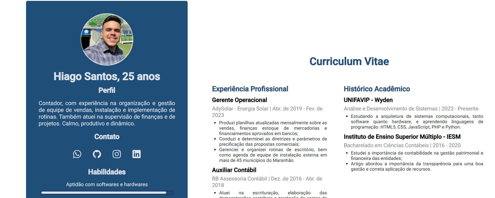

<h1 align="center">Curriculum</h1>

Projeto pessoal, com o intuito de informar e digitalizar meu currículo.

  <a href="#-tecnologias">Tecnologias</a>&nbsp;&nbsp;&nbsp;|&nbsp;&nbsp;&nbsp;
  <a href="#-projeto">Projeto</a>&nbsp;&nbsp;&nbsp;|&nbsp;&nbsp;&nbsp;
  <a href="#-layout">Layout</a>&nbsp;&nbsp;&nbsp;|&nbsp;&nbsp;&nbsp;git

 

  

## 🚀 Tecnologias

Esse projeto foi desenvolvido com as seguintes tecnologias:

- HTML
- CSS
- Git
- Github

## 💻 Projeto

O Curriculum é um histórico da minha trajetória profissional e acadêmica, em formato online.

## 🔖 Layout

O projeto foi baseado no meu modelo pessoal de currículo, que você pode visualizar através [DESSE LINK](https://drive.google.com/file/d/1Bzn8TniyW_HIH6G1R7uC7zyhPY3ZQPde/view).

---

Feito com ♥ by Hiagodsc :wave: [Me siga no Instagram!](https://www.instagram.com/hiagodsc/).